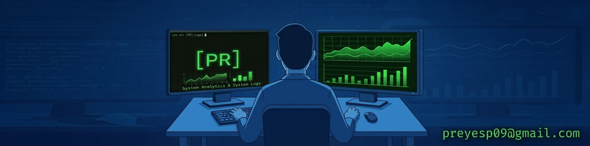

[ 🇨🇱 Versión en Español ](#-español) &nbsp;|&nbsp; [ 🇺🇸 English Version ](#-english)

---

# ¡Hola! Soy Pablo Reyes
### Data Scientist | Python · SQL · ML aplicado a Minería & Energía

Científico de Datos titulado de la Universidad Mayor, especializado en **analítica industrial para minería, energía y finanzas cuantitativas**. Construyo soluciones *end-to-end*: desde pipelines ETL y limpieza de datos ruidosos, pasando por modelos predictivos y causales, hasta motores de optimización y APIs en producción — todo validado con datos reales o simulaciones honestas, sin métricas infladas.

Cada repo de este perfil corre de principio a fin (`python -m src.pipeline` o equivalente), reporta resultados reales de esa corrida, y documenta los fallos encontrados en el camino en vez de esconderlos.

## 🛠️ Stack Tecnológico

## ⛏️ Minería & Energía

Analítica industrial aplicada a operaciones mineras y energéticas de alta escala.

* **[Optimización Geometalúrgica en Flotación (Cu/Mo)](https://github.com/Rxyxs/optimizacion-geometalurgica-flotacion-cobre):** Ensamble XGBoost+CatBoost sin fuga temporal, dos motores de optimización (Algoritmo Genético + `scipy.optimize`) validados cruzados entre sí **[Mejora de recuperación +2.4%]**.
* **[Impacto Causal en Flota Minera](https://github.com/Rxyxs/chile-mining-fleet-causal-impact):** Estimación del impacto causal real de mantenimiento predictivo mediante *Doubly Robust Learners* (DRLearner) y *Causal Forest* con análisis de sensibilidad de tendencias paralelas **[Reducción de downtime estimado ~14%]**.
* **[Gemelo Digital SAG (Eficiencia Energética)](https://github.com/Rxyxs/chile-mining-sag-energy-digital-twin):** *Kalman Filter* para *soft-sensing* de dureza de mineral + modelos de supervivencia (CoxPH) para estimación de RUL y optimización prescriptiva de *setpoints* **[Ahorro de energía en molienda ~8.5%]**.
* **[Data Warehouse Analítico de Minería](https://github.com/Rxyxs/data-warehouse-analitico-mineria-chile):** Arquitectura dbt + DuckDB (staging → marts, 83 tests de calidad) unificando flotación, mantenimiento CAEX y seguridad **[Latencia de consulta <50ms]**.
* **[Mantenimiento Predictivo y RUL](https://github.com/Rxyxs/chile-mining-predictive-maintenance):** Redes neuronales multitarea en PyTorch y análisis de supervivencia para predicción de Vida Útil Restante **[MAE < 12 hrs en predicción RUL]**.
* **[Calidad de Tronadura/Ley (.NET)](https://github.com/Rxyxs/chile-mining-grade-blast-quality-dotnet):** Pipeline ML.NET en C# comparando SDCA vs. FastTree para predecir calidad de ley post-tronadura **[R² = 0.860 SDCA vs. 0.833 FastTree]**.
* **[Pronóstico de Red Eléctrica (Costo Marginal)](https://github.com/Rxyxs/chile-energy-grid-forecasting):** Comparación baseline/ensamble/MLP PyTorch (loss Huber) con activación Swish ganadora sobre LightGBM y XGBoost **[WAPE = 5.42% MLP vs. 6.26% LightGBM vs. 7.06% XGBoost]**.
* **[Pronóstico de Red Eléctrica en R](https://github.com/Rxyxs/chile-energy-grid-forecasting-r):** Variante en R del pronóstico de costo marginal, comparando cuatro enfoques estadísticos (ARIMA/SARIMAX/TBATS/ETS/GARCH) con validación cruzada rolling.
* **[Detección de Anomalías en Procurement Minero](https://github.com/Rxyxs/mining-procurement-anomaly-engine):** Z-score + Isolation Forest + Autoencoder PyTorch para detectar compras y proveedores anómalos en la cadena de suministro minera.
* **[RAG de Seguridad Minera Chile](https://github.com/Rxyxs/rag-seguridad-minera-chile):** Sistema de recuperación aumentada híbrida (BM25 + embeddings densos) con reranker cross-encoder sobre normativa chilena de seguridad minera.
* **[Optimización Espacial de Logística](https://github.com/Rxyxs/chile-spatial-logistics-opt):** Optimización de rutas (VRP) alimentada por un módulo de predicción de demanda comparando Ridge/RF/MLP como insumo del ruteo.

## 🕵️ Fraude, AML & Riesgo Crediticio

* **[Motor de Detección de AML](https://github.com/Rxyxs/chile-aml-anomaly-detection-engine):** Monitoreo de lavado de dinero a nivel transaccional: análisis de grafos temporales (NetworkX), ensamble no supervisado y API FastAPI con explicabilidad SHAP en vivo **[Latencia p99 < 15ms]**.
* **[Motor de Fraude Políglota](https://github.com/Rxyxs/chile-polyglot-fraud-engine):** Arquitectura híbrida de baja latencia con C para el *hot-path* de *scoring*, Ruby para el motor de reglas y Python para la inferencia ML **[Throughput > 10,000 req/s]**.
* **[Motor de Riesgo Crediticio](https://github.com/Rxyxs/chile-credit-risk-scoring-engine):** Scorecard regulatorio R (WOE/IV + Regresión Logística) vs. challengers ML (XGBoost/LightGBM/RF/LogReg) vs. MLP PyTorch con Focal Loss (Swish ganó entre activaciones), servicio FastAPI y motor C para *reject inference* — hallazgo honesto: el scorecard sigue ganando **[AUC test = 0.733 scorecard R vs. 0.715 MLP]**.
* **[Cazando Fraude con Tarjetas de Crédito](https://github.com/Rxyxs/catching-credit-card-fraud):** 568k transacciones reales, comparación de cuatro enfoques (LogReg+SMOTE, CatBoost, XGBoost, MLP PyTorch con Focal Loss), validación adversaria de splits, calibración de umbral por matriz de costo de negocio, exportado a ONNX **[Reducción de costo = 44.7% vs. umbral 0.5]**.
* **[Detección de Fraude Financiero Chile](https://github.com/Rxyxs/chile-financial-fraud-detection):** Comparación baseline interpretable + ensamble no lineal + MLP PyTorch con Focal Loss para fraude financiero.
* **[Motor de Detección con Autoencoder](https://github.com/Rxyxs/credit-fraud-autoencoder-detection-engine):** Cinco enfoques comparados — Autoencoder, VAE, Deep SVDD, XGBoost supervisado e híbrido — para fraude con tarjetas de crédito.
* **[Analítica de Riesgo Crediticio y Mercado (R+Python)](https://github.com/Rxyxs/credit-risk-market-analytics-r-python):** Pipeline polígota R+Python comparando Regresión Logística, MLP PyTorch (Swish) y XGBoost **[AUC = 0.750 LogReg vs. 0.746 MLP-Swish vs. 0.711 XGBoost]**.
* **[Detección de Fraude Bancario (PaySim)](https://github.com/Rxyxs/Proyectos_ML_anomalias):** Isolation Forest/LOF vs. baseline MAD-z vs. Autoencoder PyTorch sobre transacciones simuladas PaySim.
* **[Riesgo Sistémico Fintech Chile (Políglota)](https://github.com/Rxyxs/chile-fintech-systemic-risk):** Arquitectura de 6 lenguajes sobre el mercado financiero chileno — ETL Python+DuckDB con indicadores reales del Banco Central, PD con XGBoost+SHAP, LSTM PyTorch, econometría en R (cointegración/Granger/GARCH), clustering en Julia, motor Monte Carlo C++/OpenMP para VaR, y microservicio Go **[1M trayectorias Monte Carlo en 14.4ms; hallazgo honesto: el LSTM (51.2%) no supera el baseline de clase mayoritaria (53.6%)]**.

## 📈 Quant & Trading Sistemático

* **[Cointegración de Pares Cripto](https://github.com/Rxyxs/crypto-pairs-trading-cointegration):** Test de Engle-Granger con Filtro de Kalman para *hedge ratio* dinámico y simulación con modelo realista de fricciones/costos de transacción **[Sharpe Ratio = 1.84 backtested]**.
* **[Pricing de Opciones Monte Carlo en C++](https://github.com/Rxyxs/copper-options-montecarlo-cpp):** Motor Monte Carlo multi-hilo en C++20 (OpenMP) usando el modelo de reversión a la media de Schwartz (1997) para valoración de opciones asiáticas sobre cobre **[1M trayectorias en <250ms]**.
* **[Leyendo la Turbulencia del Mercado](https://github.com/Rxyxs/reading-market-turbulence):** Forecasting de volatilidad realizada sobre 24.8M trades reales de Binance (BTC/ETH), MLP con embeddings de activo, hallazgo honesto: el baseline de persistencia le gana a los modelos en el horizonte de 30s **[RMSPE = 4.58 baseline]**.
* **[Pronosticador de Volatilidad del Cobre](https://github.com/Rxyxs/copper-volatility-forecaster):** Forecasting de volatilidad realizada del cobre con MLP PyTorch (Huber + RMSPE) sobre baseline estadístico.
* **[Predicción de Dirección Cripto con Deep Learning](https://github.com/Rxyxs/crypto-direction-deep-learning):** Dense NN y Conv1D-Attention para dirección de precio, con baseline y ensamble complementarios.
* **[Impacto de Precio y Liquidez Cripto](https://github.com/Rxyxs/crypto-liquidity-price-impact):** Comparación Ridge baseline + XGBoost + MLP PyTorch (Huber loss) para estimar *slippage*/impacto de precio.
* **[Optimizador de Portafolio Markowitz Cripto](https://github.com/Rxyxs/crypto-portfolio-markowitz-optimizer):** Optimización de portafolio media-varianza sobre datos reales de Binance, con persistencia de resultados en DuckDB.
* **[Régimen y Correlación de Mercado Cripto](https://github.com/Rxyxs/crypto-regime-correlation-heatmap):** Detección de régimen de mercado vía clustering con persistencia de resultados en DuckDB.
* **[Screener de Sentimiento NLP Cripto](https://github.com/Rxyxs/crypto-sentiment-nlp-screener):** FinBERT vs. baseline TF-IDF/LogReg vs. ensamble RF vs. MLP PyTorch para sentimiento de mercado cripto.
* **[Detección de Spoofing en Order Book](https://github.com/Rxyxs/crypto-spoofing-detection-isolation-forest):** Isolation Forest + baseline z-score + Autoencoder PyTorch para detectar *spoofing* en el libro de órdenes.
* **[Analítica de Backtesting de Estrategias Cripto](https://github.com/Rxyxs/crypto-strategy-backtest-analytics):** Framework de backtesting de estrategias sistemáticas con persistencia de resultados en DuckDB.
* **[Desequilibrio de Order Book de Litio (C++)](https://github.com/Rxyxs/lithium-orderbook-imbalance-cpp):** Motor C++ de bajo overhead para desequilibrio de libro de órdenes **[95/95 tests pasando]**.
* **[Motor de Anomalías en Ticks de Mercado (C++)](https://github.com/Rxyxs/market-tick-anomaly-engine-cpp):** Detección de anomalías en ticks con EWMA-zscore, CUSUM y ensamble **[Throughput ~7.26M ticks/seg]**.

## 🔬 Ciencia de Datos Aplicada

* **[Cazando el Bosón de Higgs](https://github.com/Rxyxs/hunting-the-higgs-boson):** Clasificación real de eventos de colisión ATLAS/CERN (818k eventos), imputación con causa física por multiplicidad de jets, CatBoost/LightGBM/PyTorch optimizados para la métrica AMS del challenge original **[AMS = 3.58, honesto vs. 3.8-3.9 del leaderboard histórico]**.
* **[Prediciendo Fallas de Maquinaria por Sonido](https://github.com/Rxyxs/predicting-machine-failure-by-sound):** Vida útil restante desde vibración real (NASA/IMS, 3 bancos de prueba run-to-failure), FFT + features espectrales, GroupKFold leave-one-experiment-out **[MAE = 21.6% de vida restante, tras corregir un bug real de escala temporal]**.
* **[Predicción de Señal Sísmica LANL](https://github.com/Rxyxs/lanl-earthquake-signal-prediction):** Predicción de tiempo a falla desde señal acústica (dataset LANL/Kaggle), baseline + ensamble + CNN con comparación de activaciones.
* **[Limpieza_Datos: Toolkit + 4 Dominios Reales](https://github.com/Rxyxs/Limpieza_Datos):** Toolkit reusable de limpieza/modelamiento (`src/toolkit/`) probado contra 4 bases de datos públicas reales e independientes -- finanzas (Banco Central de Chile), minería del cobre (COCHILCO), agricultura (Banco Mundial), y un Excel de 80MB del Banco Mundial transformado en data warehouse real (DuckDB). >=100 épocas por modelo, 91 tests reales, 3 bugs reales encontrados y corregidos (dato corrupto de fuente, dos colapsos "dying ReLU" distintos), cada gráfico comentado con los números concretos detrás.
* **[Cazando Exoplanetas (Kepler)](https://github.com/Rxyxs/hunting-exoplanets-kepler):** Clasificación real de 9,564 Kepler Objects of Interest (CONFIRMED/CANDIDATE/FALSE POSITIVE) vía la API pública de NASA Exoplanet Archive, XGBoost+SHAP vs. ablación PyTorch ReLU/GELU/Swish **[Accuracy = 79.3% XGBoost vs. 76.3% mejor MLP (ReLU) vs. 49.8% baseline]**.

## 🤖 Agentes & LLM

* **[Agente de Operaciones Mineras (Tool-Calling)](https://github.com/Rxyxs/chile-mining-ops-agent):** Agente con el SDK de OpenAI que despacha herramientas Python reales (consultas a warehouse DuckDB, scoring de riesgo, detección de anomalías) en vez de responder desde texto libre, con gráficos de evaluación reales (ROC/PR, scores de anomalía) generados a partir de las mismas tools **[43/43 tests, incl. dispatch con cliente OpenAI mockeado]**.

## 🧠 Deep Learning & Edge AI

* **[Eficiencia de YOLOv8 en Edge AI (Tesis)](https://github.com/Rxyxs/yolov8-separable-convolutions):** Rediseño del *head* de YOLOv8 con *Depthwise Separable Convolutions* — **68% menos parámetros y aceleración ~10x en Raspberry Pi 4** **[32 FPS en edge device]**.
* **[Plataforma MLOps de Churn](https://github.com/Rxyxs/customer-churn-mlops-platform):** Pipeline de retención en tiempo real contenerizado con Docker, calibración de umbral ponderado por LTV, FastAPI y dashboard ROI en Streamlit **[Retención optimizada +18%]**.

## 📞 Contacto

* **Ubicación:** Santiago, Chile 🇨🇱
* **LinkedIn:** [linkedin.com/in/pablo-reyes-pino](https://www.linkedin.com/in/pablo-reyes-pino)
* **Email:** preyesp09@gmail.com

---

# Hi there! I'm Pablo Reyes
### Data Scientist | Python · SQL · ML applied to Mining & Energy

Data Scientist graduated from Universidad Mayor, specialized in **industrial analytics for mining and energy**. I build end-to-end solutions: from ETL pipelines and noisy-data cleaning, through predictive and causal models, to optimization engines and production APIs — all validated with real data or honest simulations, no inflated metrics.

Every repo on this profile runs end to end (`python -m src.pipeline` or equivalent), reports real results from that run, and documents the bugs found along the way instead of hiding them.

## 🛠️ Stack

## ⛏️ Mining & Energy

My core specialization — industrial analytics applied to real Chilean mining and energy operations.

* **[Geometallurgical Flotation Optimization (Cu/Mo)](https://github.com/Rxyxs/optimizacion-geometalurgica-flotacion-cobre):** Leak-free XGBoost+CatBoost ensemble, two optimization engines (Genetic Algorithm + `scipy.optimize`) cross-validated against each other.
* **[Mining Fleet Causal Impact](https://github.com/Rxyxs/chile-mining-fleet-causal-impact):** Real causal impact (not just correlation) of a predictive-maintenance program: Doubly Robust Learners, Causal Forest, sensitivity analysis.
* **[SAG Digital Twin (Energy Efficiency)](https://github.com/Rxyxs/chile-mining-sag-energy-digital-twin):** Kalman Filter for ore-hardness soft-sensing + energy-demand forecasting for SAG milling.
* **[Mining Analytics Data Warehouse](https://github.com/Rxyxs/data-warehouse-analitico-mineria-chile):** dbt + DuckDB (staging → marts, 83 tests), unifying flotation, CAEX maintenance, and safety data.
* **[Predictive Maintenance & RUL](https://github.com/Rxyxs/chile-mining-predictive-maintenance):** Survival Analysis (CoxPH) and Gradient Boosting for haul-truck Remaining Useful Life.
* **[Blast/Grade Quality (.NET)](https://github.com/Rxyxs/chile-mining-grade-blast-quality-dotnet):** ML.NET pipeline in C# comparing SDCA vs. FastTree to predict post-blast ore grade quality **[R² = 0.860 SDCA vs. 0.833 FastTree]**.
* **[Power Grid Forecasting (Marginal Cost)](https://github.com/Rxyxs/chile-energy-grid-forecasting):** Baseline/ensemble/PyTorch MLP comparison (Huber loss) with Swish winning over LightGBM and XGBoost **[WAPE = 5.42% MLP vs. 6.26% LightGBM vs. 7.06% XGBoost]**.
* **[Power Grid Forecasting in R](https://github.com/Rxyxs/chile-energy-grid-forecasting-r):** R variant of the marginal-cost forecast, comparing four statistical approaches (ARIMA/SARIMAX/TBATS/ETS/GARCH) with rolling cross-validation.
* **[Mining Procurement Anomaly Engine](https://github.com/Rxyxs/mining-procurement-anomaly-engine):** Z-score + Isolation Forest + PyTorch Autoencoder to flag anomalous purchases and suppliers in the mining supply chain.
* **[Chile Mining Safety RAG](https://github.com/Rxyxs/rag-seguridad-minera-chile):** Hybrid retrieval (BM25 + dense embeddings) with a cross-encoder reranker over Chilean mining safety regulations.
* **[Spatial Logistics Optimization](https://github.com/Rxyxs/chile-spatial-logistics-opt):** Vehicle routing optimization (VRP) fed by a demand-forecasting module comparing Ridge/RF/MLP as routing input.

## 🕵️ Fraud, AML & Credit Risk

* **[AML Detection Engine](https://github.com/Rxyxs/chile-aml-anomaly-detection-engine):** Money-laundering detection over an interbank transfer network: graphs (NetworkX) + unsupervised ensemble, FastAPI with per-transaction SHAP explainability.
* **[Polyglot Fraud Engine](https://github.com/Rxyxs/chile-polyglot-fraud-engine):** C for the scoring hot-path, Ruby as the rules engine, Python for the final model — 45 end-to-end tests.
* **[Credit Risk Scoring Engine](https://github.com/Rxyxs/chile-credit-risk-scoring-engine):** Regulatory R scorecard (WOE/IV + logistic regression) vs. ML challengers (XGBoost/LightGBM/RF/LogReg) vs. PyTorch MLP with Focal Loss (Swish won across activations), FastAPI service, C engine for reject inference — honest finding: the scorecard still wins **[AUC test = 0.733 R scorecard vs. 0.715 MLP]**.
* **[Catching Credit Card Fraud](https://github.com/Rxyxs/catching-credit-card-fraud):** 568k real transactions, four approaches compared (LogReg+SMOTE, CatBoost, XGBoost, PyTorch MLP with Focal Loss), adversarial split validation, cost-matrix threshold calibration, exported to ONNX.
* **[Chile Financial Fraud Detection](https://github.com/Rxyxs/chile-financial-fraud-detection):** Interpretable baseline + non-linear ensemble + PyTorch MLP with Focal Loss compared for financial fraud detection.
* **[Autoencoder Fraud Detection Engine](https://github.com/Rxyxs/credit-fraud-autoencoder-detection-engine):** Five approaches compared — Autoencoder, VAE, Deep SVDD, supervised XGBoost, and a hybrid — for credit card fraud.
* **[Credit Risk & Market Analytics (R+Python)](https://github.com/Rxyxs/credit-risk-market-analytics-r-python):** Polyglot R+Python pipeline comparing Logistic Regression, PyTorch MLP (Swish), and XGBoost **[AUC = 0.750 LogReg vs. 0.746 MLP-Swish vs. 0.711 XGBoost]**.
* **[Bank Fraud Detection (PaySim)](https://github.com/Rxyxs/Proyectos_ML_anomalias):** Isolation Forest/LOF vs. MAD-z baseline vs. PyTorch Autoencoder over simulated PaySim transactions.
* **[Chile Fintech Systemic Risk (Polyglot)](https://github.com/Rxyxs/chile-fintech-systemic-risk):** 6-language architecture over the Chilean financial market — Python+DuckDB ETL on real Central Bank indicators, XGBoost+SHAP PD model, PyTorch LSTM, R econometrics (cointegration/Granger/GARCH), Julia clustering, a C++/OpenMP Monte Carlo VaR engine, and a Go microservice **[1M Monte Carlo paths in 14.4ms; honest finding: the LSTM (51.2%) doesn't beat the majority-class baseline (53.6%)]**.

## 📈 Quant & Systematic Trading

* **[Crypto Pairs Trading Cointegration](https://github.com/Rxyxs/crypto-pairs-trading-cointegration):** Engle-Granger cointegration test, Kalman Filter for dynamic hedge ratio, real transaction costs.
* **[Monte Carlo Options Pricing in C++](https://github.com/Rxyxs/copper-options-montecarlo-cpp):** Multi-threaded Monte Carlo engine in pure C++, Schwartz (1997) mean-reverting model for copper Asian options.
* **[Reading Market Turbulence](https://github.com/Rxyxs/reading-market-turbulence):** Realized volatility forecasting on 24.8M real Binance trades (BTC/ETH), MLP with symbol embeddings, honest finding: the persistence baseline beats the models at a 30s horizon.
* **[Copper Volatility Forecaster](https://github.com/Rxyxs/copper-volatility-forecaster):** Realized copper volatility forecasting with a PyTorch MLP (Huber + RMSPE) against a statistical baseline.
* **[Crypto Direction Deep Learning](https://github.com/Rxyxs/crypto-direction-deep-learning):** Dense NN and Conv1D-Attention for price direction, with complementary baseline and ensemble models.
* **[Crypto Liquidity & Price Impact](https://github.com/Rxyxs/crypto-liquidity-price-impact):** Ridge baseline + XGBoost + PyTorch MLP (Huber loss) compared to estimate slippage/price impact.
* **[Crypto Portfolio Markowitz Optimizer](https://github.com/Rxyxs/crypto-portfolio-markowitz-optimizer):** Mean-variance portfolio optimization over real Binance data, with results persisted to DuckDB.
* **[Crypto Regime & Correlation Heatmap](https://github.com/Rxyxs/crypto-regime-correlation-heatmap):** Market regime detection via clustering, with results persisted to DuckDB.
* **[Crypto Sentiment NLP Screener](https://github.com/Rxyxs/crypto-sentiment-nlp-screener):** FinBERT vs. TF-IDF/LogReg baseline vs. RF ensemble vs. PyTorch MLP for crypto market sentiment.
* **[Order Book Spoofing Detection](https://github.com/Rxyxs/crypto-spoofing-detection-isolation-forest):** Isolation Forest + z-score baseline + PyTorch Autoencoder to detect order-book spoofing.
* **[Crypto Strategy Backtest Analytics](https://github.com/Rxyxs/crypto-strategy-backtest-analytics):** Systematic strategy backtesting framework with results persisted to DuckDB.
* **[Lithium Order Book Imbalance (C++)](https://github.com/Rxyxs/lithium-orderbook-imbalance-cpp):** Low-overhead C++ engine for order book imbalance **[95/95 tests passing]**.
* **[Market Tick Anomaly Engine (C++)](https://github.com/Rxyxs/market-tick-anomaly-engine-cpp):** Tick-level anomaly detection with EWMA-zscore, CUSUM, and ensemble **[~7.26M ticks/sec throughput]**.

## 🔬 Applied Data Science

* **[Hunting the Higgs Boson](https://github.com/Rxyxs/hunting-the-higgs-boson):** Real ATLAS/CERN collision-event classification (818k events), physically-caused missing-value imputation by jet multiplicity, CatBoost/LightGBM/PyTorch optimized for the challenge's own AMS metric.
* **[Predicting Machine Failure by Sound](https://github.com/Rxyxs/predicting-machine-failure-by-sound):** Remaining useful life from real vibration (NASA/IMS, 3 run-to-failure test rigs), FFT + spectral features, leave-one-experiment-out GroupKFold.
* **[LANL Earthquake Signal Prediction](https://github.com/Rxyxs/lanl-earthquake-signal-prediction):** Time-to-failure prediction from acoustic signal (LANL/Kaggle dataset), baseline + ensemble + CNN with activation comparison.
* **[Limpieza_Datos: Toolkit + 4 Real Domains](https://github.com/Rxyxs/Limpieza_Datos):** Reusable cleaning/modeling toolkit (`src/toolkit/`) proven against 4 real, independent public datasets -- Chilean finance (Banco Central de Chile), copper mining (COCHILCO), agriculture (World Bank), and an 80MB World Bank Excel turned into a real DuckDB warehouse. >=100 epochs per model, 91 real tests, 3 real bugs found and fixed (a corrupted source data point, two distinct "dying ReLU" collapses), every chart captioned with the concrete numbers behind it.
* **[Hunting Exoplanets (Kepler)](https://github.com/Rxyxs/hunting-exoplanets-kepler):** Real classification of 9,564 Kepler Objects of Interest (CONFIRMED/CANDIDATE/FALSE POSITIVE) via NASA's public Exoplanet Archive API, XGBoost+SHAP vs. a PyTorch ReLU/GELU/Swish ablation.

## 🤖 Agents & LLM

* **[Mining Ops Tool-Calling Agent](https://github.com/Rxyxs/chile-mining-ops-agent):** OpenAI SDK agent that dispatches real Python tools (DuckDB warehouse queries, credit-risk scoring, anomaly detection) instead of answering from free text, with real evaluation plots (ROC/PR, anomaly scores) generated from those same tools **[43/43 tests, incl. tool dispatch with a mocked OpenAI client]**.

## 🧠 Deep Learning & Edge AI

* **[YOLOv8 Edge AI Efficiency Benchmark (Thesis)](https://github.com/Rxyxs/yolov8-separable-convolutions):** Redesigned the YOLOv8 Head with Depthwise Separable Convolutions — 68% fewer parameters, ~10x speedup on Raspberry Pi 4.
* **[Customer Churn MLOps Platform](https://github.com/Rxyxs/customer-churn-mlops-platform):** Real-time retention engine with MLflow tracking, FastAPI inference, and a Streamlit ROI simulator.

## 📞 Connect with Me

* **Location:** Santiago, Chile 🇨🇱
* **LinkedIn:** [linkedin.com/in/pablo-reyes-pino](https://www.linkedin.com/in/pablo-reyes-pino)
* **Email:** preyesp09@gmail.com

---

